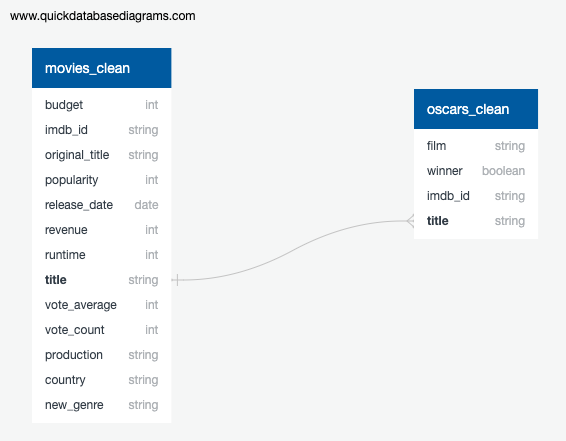

# Team-4
## Team 4 Project Team: 
Archie Anand [Github](https://github.com/archieanand) 
Jose Curi [GitHub](https://github.com/joseluiscuri) 
Varsha Jha [GitHub](https://github.com/varshajha28) 
Will Warriner [GitHub](https://github.com/Sukurudo) 

## Team Communication Methodology
Team Communication: Primary use Slack Channel #project-04 for written and up to date communication; 
Team Meetings using Zoom
Secondary communiction channel will be: Whatsap and Email if necessry

## ERD

## Topic
Academy Awards(Oscars) is a big event for film industry as the award signify international recognition of excellence for actors, directors, writers, designers, and much more. The awards are given with a variety of different nominees from across different genres. To celebrate the world’s love of art and our love of data, we’ve leveraged the power of automated machine learning to put together our own prediction what movies are more likely to win an oscar in any of the given categories.

## Resources

**Utilizing Movie Data from different Sources:** 
The Movie Dataset: https://www.kaggle.com/rounakbanik/the-movies-dataset  
Oscars Dataset: https://www.kaggle.com/unanimad/the-oscar-award

## Input Files
From Movie Dataset: 
movies_metadata.csv  
academy_awards.csv 

Movies_metadata.csv containes information from IMDB and The Movies Database of over 30,000 movies
Academy_Awards.csv containes nominees and winners of all Academy awards up to 2020

## Technologies Used
- Software: 
- 1. Tablaeu
- 2. Python, Pandas and SciKitLearn
- 3. Postgres and AWS

## Data Cleaning and Exploration Phase
Pandas will be used to clean the data and perform an exploratory analysis. Further analysis will be completed using Python. Both Original databases will be analized and information prepared for a Machine Learning environment. Unecessary data columns will be dropped to ease the transition to a SQL database in preparation of merging both datasets.

Based on our analysis, we determined the following features were important for our result:
**Movies_Metadata.csv**: Budget, Imdb_ID, Orginal Title, Popularity, Revenue, Runtime, Title, Vote Average, Vote Count, Production company, Country, Genre, and Release Year

**academy_awards.csv**: Film, Winner

## Database Storage
We intend to store the data as SQL using Postgres, and we will connect it to AWS environment to share the data.

## Machine Learning Analysis Phase
SciKitLearn is the ML library we'll be using to create a classifier. We are planning on using three different machine learning methologies an comparing the results. We will be using a *Random Forrest model, a Decision Tree Model, and a Logistic Regression Model.*

## Result
We are planning to build the machine learning model which will predict whether the particular movie will win the award in any category.

## Dashboard
We are planning to use Tableau for the dashboard and will be displaying the analysis from all three methologies.
