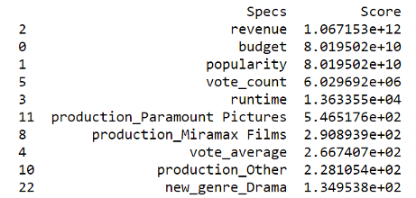
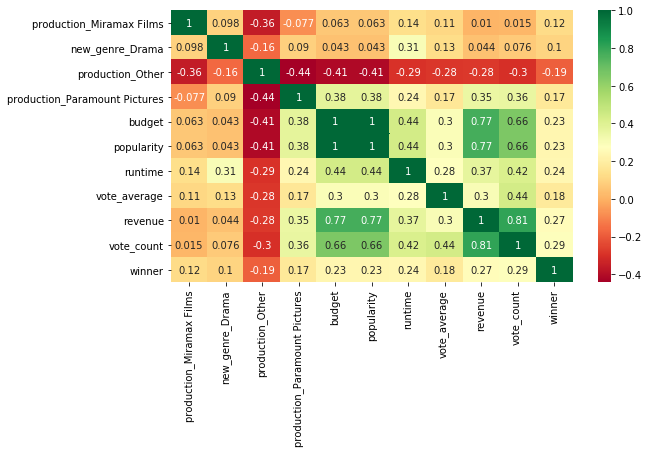

# Machine Learning Model
Description of preliminary data preprocessing:

## Preprocessing

Before this raw dataset is used for classification, it must be modified so it can be suitable for analysis. Many features are missing from many movies and it must be handled. New features will be created to help analysis. And analyzing the data will determine which features are useful for classification.

## Data Cleaning

In the raw dataset, the movies had a missing budget and revenue. Many of the movies have a null runtime. All these features are necessary for analysis, so the movie is dropped if any of these features are missing.

A movie is also dropped if it is a pornographic film. This is because nature of these movies is extremely different than theatric movies.

Only the movie with status released is included in the movie dataset.

The award dataset was process in the similar fashion by dropping the null value.

**Description of preliminary feature engineering and preliminary feature selection, including their decision-making process:**

## Feature Extraction

Some features are created using existing features. The target variable &quot;winner&quot; was included in the award dataset. The feature &#39;year&#39; is created from release date because a single year is much easier to process compared to an entire date. Also, month and day are not relevant to a movie&#39;s being a winner of the award.

The most significant genre, country, and production company are extracted from their respective lists. This is to improve processing time and because a feature that is a list of categorical labels requires a more complex analysis.

The data type of budget and popularity was converted to the integer type and float respectively so that they are not considered like a categorical data.

Obscure foreign films are not wanted because it will lower the accuracy of the model. Hence, only the movie with country (United States of America) was included. This was not a huge loss because only few movies were removed.

## Feature Selection

We did the feature selection based on three methods to compare the importance of various features available in the cleaned dataset:

Univariate Selection: In order to select the features that have the strongest relationship with the output variable, the chi-squared statistical test was performed using the SelectKBest class of the scikit-learn library.

The results of the Univariate Selection are as follows:

The second method to generate the score for each feature, an inbuilt class that comes with the Tree based Classifier was used. The following bar chart tells us the top 10 features for the database.

Correlation Matrix with Heatmap shows the correlation between the features and the target variables. The following heatmap shows the correlation coefficient between continuous variables. If a value is too high, the corresponding features are redundant and unnecessary.

The graph on the left shows popularity, which seems to be heavily skewed toward the most recent movies. The graph on the right shows that the revenue does not share any pattern with popularity. So, popularity is not useful for classification and is dropped from the dataset.

In summary, the following features are dropped for not being useful in predicting winner:

- title – alternate title is not relevant
- release\_date – replaced by year
- status – dataset assumes all movies are released
- genres – replaced by single genre
- production\_countries – replaced by single country
- production\_companies – too much variance in companies
- adult – pornographic movies are removed from the dataset

**Description of how data was split into training and testing sets:**

The data was split into the training and testing set using the scikit-learn library.

**Explanation of model choice, including limitations and benefits:**

We ran the dataset via three different machine learning model which yielded the following accuracy.

1. Logistic regression: Logistic regression is promising because it works best when the target variable is a Boolean value, and our target variable, winner, is Boolean. The solver selected for the variation of the logistic regression algorithm was &quot;ibfgs&quot;. The Accuracy for the dataset in this model was 0.79

1. Decision Tree: The decision tree works by setting a division threshold for each feature to predict the target variable. There are two main criteria for determining when to split a tree node, gini and entropy. A decision tree tends to get overfitted when there are no boundaries for tree size. The Accuracy for the dataset in this model was 0.87

1. RandomForest: The random forest algorithm is an ensemble version of the decision tree algorithm, which means that the model uses multiple decision trees. Because of this, the random forest accuracy is expected to be better than the previous decision tree. This algorithm uses the same hyper-parameters as the decision tree except for number of trees (n\_estimators). The random forest accuracy was same as the decision tree accuracy as 0.87
